<!-- Banner Topo -->


<div align="center">

# 👋 Olá, eu sou o Antonio Gabriel

### **Desenvolvedor Full-Stack focado em Backend, Automações e Produtos Digitais**

Portfólio, contatos e redes sociais de forma rápida:

[](https://antoniogabriel.vercel.app)
[](https://br.linkedin.com/in/antoniofalcaonascimento)
[](mailto:nascimentogabriel.2004@gmail.com)
[](https://github.com/copperlamb78)

---

</div>

## 🚀 Sobre mim

Sou um desenvolvedor em evolução constante, movido pelo desafio de criar aplicações úteis, organizadas e com impacto real no ecossistema de empresas e usuários.

* 💼 **Atuação Atual:** Faço parte do time da **Contas Contabilidade** (uma das maiores empresas do setor na Bahia/Nordeste), desenvolvendo automações, otimizando processos internos e criando soluções voltadas para a produtividade extrema.
* 🧠 **Filosofia de Código:** Gosto de construir projetos do zero para dominar as regras de negócio e a arquitetura subjacente. Uso IA de forma estratégica para produtividade, mas prezo pelo aprendizado sólido e manual das bases técnicas.

> 💡 *Para mim, tecnologia precisa resolver problemas reais e gerar valor, não apenas parecer bonita no código.*

---

## 🛠️ Stack Principal

<div align="center">

### 💻 Frontend


### ⚙️ Backend & APIs


### 🗄️ Banco de Dados


### 🤖 Automação, Scraping & Ferramentas


</div>

---

## 🎯 Foco Atual & Desenvolvimento

* 🛠️ **Backend Sólido:** Construção de APIs REST robustas e estruturadas com **NestJS**, **Node.js** e **TypeScript**, sempre documentadas com **Swagger**.
* 📊 **Persistência:** Otimização de consultas e modelagem de dados utilizando **PostgreSQL** e **MongoDB**.
* 🤖 **Web Scraping:** Desenvolvimento de crawlers eficientes e automações complexas com **Python**, **Selenium** e **Playwright**.
* 🚀 **Em Destaque (Toolkit):** Projeto acadêmico full-stack estruturado em **NestJS**. A API inicial foi criada em apenas 1 dia como um desafio pessoal de arquitetura e velocidade de entrega, evoluindo agora sem dependência de geradores automáticos para fixação de conceitos críticos.

---

## 📌 Projetos em Destaque

| Projeto | Principais Tecnologias | Descrição |
| :--- | :--- | :--- |
| 🧰 **Toolkit** | NestJS, TypeScript, JS | API robusta focada em arquitetura escalável e organização rígida de rotas. |
| 💼 **BusinessCorp** | TypeScript, HTML/CSS | Portfólio institucional sob medida para TCC de Administração do SENAI. |
| 💳 **SaaS Financeiro** | Stack Full-Stack | Sistema focado em controle financeiro pessoal/empresarial e experiência de uso limpa. |
| 🌐 **Portfólio Pessoal** | Next.js, TypeScript | Minha vitrine digital para consolidar projetos, artigos e histórico profissional. |
| ♻️ **Electronic Recycling** | TypeScript, Geolocalização | App que mapeia pontos de descarte eletrônico próximos com base no IP do usuário. |
| 🛡️ **Gerador de CPF** | Python | Script inteligente para validação, geração e exportação de CPFs válidos. |
| 📝 **Task List** | Python | Utilitário leve e objetivo voltado para a gestão de tarefas cotidianas. |

---

## 💼 Serviços Freelancer & Soluções Comerciais

Estou expandindo minha atuação como desenvolvedor independente. Desenvolvo soluções sob medida com foco em performance e prazos reais:

* 🌐 **Aplicações Web:** Landing Pages de alta conversão, Sites Institucionais e Portfólios de alto padrão.
* ⚙️ **Sistemas & Integrações:** Criação de APIs REST, Dashboards dinâmicos, Ferramentas internas e Conexão de Bancos de Dados.
* 🤖 **Inteligência Operacional:** Automação de processos manuais na web, web scraping e extração estruturada de dados.

---

## 📊 Estatísticas do GitHub

<div align="center">



</div>

---

## 🧩 Um Pouco da Minha Sintaxe

```ts
const antonioGabriel = {
  role: "Full-Stack Developer",
  focus: ["Backend", "APIs", "Automações", "SaaS", "Freelance"],
  mainStack: ["Node.js", "NestJS", "TypeScript", "Python", "FastAPI", "React", "Next.js"],
  currentlyLearning: ["Arquitetura Backend", "PostgreSQL", "APIs REST", "Swagger", "Boas práticas"],
  mindset: "Construir, testar, errar, melhorar e repetir."
};
